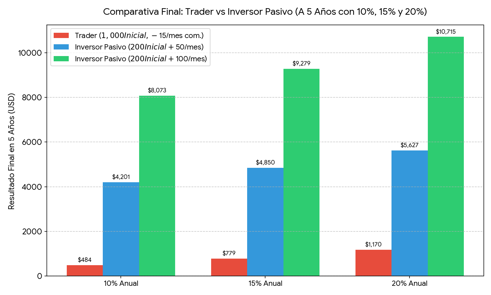
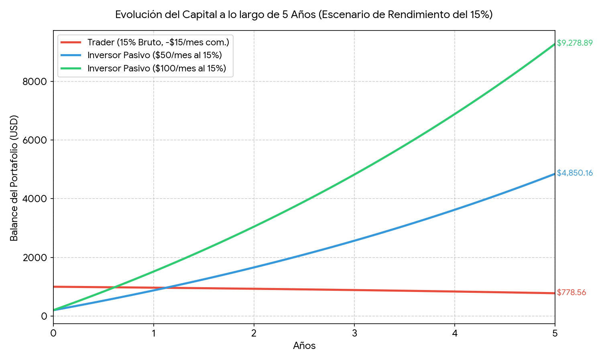

# 📈 Simulación Financiera: Trader Activo vs. Inversor Indexado Pasivo

Este proyecto realiza una simulación matemática a **5 años (60 meses)** utilizando Python para comparar dos filosofías de inversión drásticamente opuestas: el **Trading Activo con capital estático** frente a la **Inversión Pasiva Indexada con aportes recurrentes (DCA)**. 

El objetivo es modelar el impacto real de los costos fijos operacionales (*commission drag*) y el poder del flujo de caja constante sobre cuentas de capital pequeño.

---

## 🎛️ Parámetros de la Simulación

### 1. Trader Activo
* **Capital Inicial:** $1,000 USD (Único aporte, sin inyecciones de capital adicionales).
* **Costos Operativos:** $15 USD mensuales (Fijo conservador que engloba comisiones de plataforma, spreads y *slippage*).
* **Rendimientos Brutos Evaluados:** 10%, 15% y 20% anual.

### 2. Inversor Pasivo (DCA)
* **Capital Inicial:** $200 USD.
* **Aportes Recurrentes:** Evaluado en dos escenarios: **$50 USD/mes** y **$100 USD/mes**.
* **Costos Operativos:** $0 USD (Utilizando ETFs eficientes de bajo costo sin comisión de corretaje).
* **Rendimientos Anuales Evaluados:** 10%, 15% y 20% anual.

---

## 📐 Modelo Matemático

### Inversor Indexado Pasivo (Anualidad Ordinaria)
El crecimiento de la cuenta con aportes constantes se modela mediante la fórmula de valor futuro de una anualidad con capitalización mensual:

$$FV = PMT \times \frac{\left(1 + \frac{r}{n}\right)^{nt} - 1}{\frac{r}{n}} + PV \left(1 + \frac{r}{n}\right)^{nt}$$

Donde:
* $PMT$ = Aporte mensual ($50 o $100 USD)
* $PV$ = Capital inicial ($200 USD)
* $r$ = Tasa de interés anual (10%, 15%, 20%)
* $n$ = 12 (Capitalización mensual)
* $t$ = 5 años

### Trader Activo (Relación de Recurrencia)
El balance del trader disminuye mes a mes por una constante de fricción ($C$), modelándose de la siguiente forma para cada mes $m$:

$$B_m = B_{m-1} \left(1 + \frac{r}{12}\right) - C$$

Al expandir algebraicamente la serie temporal para 60 meses, el balance final se rige por:

$$B_m = B_0 \left(1 + \frac{r}{12}\right)^m - C \times \frac{\left(1 + \frac{r}{12}\right)^m - 1}{\frac{r}{12}}$$

Donde:
* $B_0$ = Capital inicial ($1,000 USD)
* $C$ = Comisiones fijas ($15 USD/mes)

---

## 📊 Resultados y Análisis Financiero

Tras simular los 60 meses, los balances finales de los portafolios arrojan los siguientes datos:

| Estrategia de Inversión | Al 10% Anual | Al 15% Anual | Al 20% Anual | Capital Total Aportado |
| :--- | :---: | :---: | :---: | :---: |
| **Trader Activo** ($1,000 Único) | **$483.75** | **$778.56** | **$1,169.60** | $1,000.00 |
| **Inversor Pasivo** ($50/mes) | **$4,200.92** | **$4,850.16** | **$5,627.10** | $3,200.00 |
| **Inversor Pasivo** ($100/mes) | **$8,072.77** | **$9,278.89** | **$10,715.01** | $6,200.00 |

### 📉 Comparativa Visual de Resultados Finales


### 📈 Evolución del Capital en el tiempo (Escenario 15%)
La trayectoria temporal del dinero evidencia cómo la fricción erosiona la cuenta pequeña del trader mientras la constancia potencia al inversor pasivo:


---

## 💡 Conclusiones del Proyecto

1. **La "Tiranía" de los Costos Fijos:** Un costo operativo de $15 USD en una cuenta de $1,000 USD equivale a un lastre del **1.5% mensual (18% anual)**. El trader necesita un rendimiento extraordinario solo para quedar en tablas. Las cuentas de trading pequeñas no son viables si sufren comisiones fijas.
2. **El Flujo de Caja supera a la Habilidad:** El inversor pasivo que aporta $100 USD mensuales bajo un rendimiento promedio de mercado (10%) termina con **$8,072.77 USD**, superando por **7.2 veces** al trader sobresaliente que operó a una tasa del 20% anual.
3. **Eficiencia en Tiempo y Esfuerzo:** La inversión pasiva indexada (DCA) requiere menos de 10 minutos al mes de gestión automática, eliminando el riesgo psicológico, el estrés y el desgaste horario del trading activo.

---

## 🚀 Cómo Ejecutar el Código

1. Clona este repositorio:
```bash
   git clone [https://github.com/tu-usuario/trader-vs-pasivo-sim.git](https://github.com/tu-usuario/trader-vs-pasivo-sim.git)
```bash

2. Instala las dependencias requeridas:
```bash
   pip install numpy matplotlib pandas
```bash

3. Ejecuta el script de simulación para generar los gráficos:
```bash
   python trading_vs_passive.py
```bash
